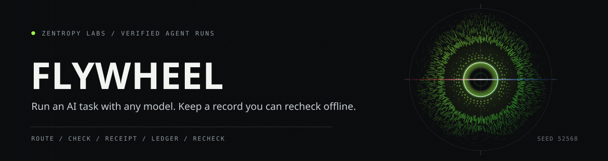

<p align="center"></p>

**Run an AI task with any model. Keep a record you can recheck offline.**

[](https://pypi.org/project/flywheel-verify/)
[](LICENSE)
[](https://github.com/HarperZ9/flywheel/actions/workflows/ci.yml)
[](https://pypi.org/project/flywheel-verify/)


Flywheel runs an AI task with the local or hosted model and tools you choose. It
records the run, and optional sealed tool-call receipts can be inspected and
rechecked offline. The repository also includes a native desktop app.

Flywheel has two parts. The Python engine routes tasks, checks tool requests,
runs verification, writes the run ledger, and serves a local gateway. The
Flutter client provides the native desktop interface.

[Project Telos](https://harperz9.github.io) | [gather](https://github.com/HarperZ9/gather) | [crucible](https://github.com/HarperZ9/crucible) | [index](https://github.com/HarperZ9/index) | [forum](https://github.com/HarperZ9/forum) | [telos](https://github.com/HarperZ9/telos) | [learn](https://github.com/HarperZ9/learn) | [relay](https://github.com/HarperZ9/relay) | [mneme](https://github.com/HarperZ9/mneme)

## Try it

For the native desktop app, download the Windows installer from
[Releases](https://github.com/HarperZ9/flywheel/releases). It carries its own
engine, so the app runs on a clean machine with no Python installed, and it
starts that engine itself.

For the engine on its own:

```powershell
python -m pip install flywheel-verify
flywheel up
```

This starts the local API gateway on `http://127.0.0.1:8799` and serves a
browser shell there. The shell is the fallback surface for development and
CI; the desktop app is the native one.

## How a run works

One task, from the moment you send it to the point where somebody who was not
there can check it. Every stage writes a receipt, and the last stage needs no
network and no model.

<p align="center"></p>

The refusal edge is the one worth reading twice. A blocked tool request is not
an error the run dies on: the reason goes back to the model, which can pick a
different route. What the ledger keeps is the request, the refusal, and the
reason, so a reader later can see what was asked for as well as what ran.

## What the capability check decides

Stage four reads a shell command the way a shell reads it, then names what
the command is able to do. That name settles the decision. Seven commands
are below with the reason each one lands where it does.

<p align="center"></p>

A denied word matters only in the executable position, so quoted text
prints and a substitution gets walked into. The marked row is the gap this
repository does not paper over: the map of names is curated by hand, and an
executable it has never seen is admitted, then written down as unknown.

## Verification record

The review for [pull request #60](https://github.com/HarperZ9/flywheel/pull/60)
records the checks for this README change:

- The file-size, standard-library verifier, claim-language, public-instruction,
  and writing gates passed.
- `python -m harness.cli_entry gate` returned `PASS` and an offline recheck of
  `MATCH`.
- GitHub Actions ran the whole test suite on Ubuntu and Windows. The linked CI
  checks are the source of record; this README does not freeze a test count
  that can change by revision or platform.

These checks cover the repository's deterministic code and documentation
paths. They do not prove that a model answer is correct, measure live provider
reliability, or test every host and hardware configuration.

## Benchmarks

<!-- benchmarks:begin generated by scripts/build_benchmark_page.py, do not edit -->
6 suites run with no model endpoint and no network, so you get these numbers
back on your own machine:

```bash
python scripts/run_offline_benchmarks.py
```

| suite | what it answers | headline |
| --- | --- | --- |
| accountability | does an unaccountable system score badly here | dimensions 8; harness_overall 1.0; separation 1.0; strawman_overall 0.0 |
| governed-agent | does a workflow refuse an action above its tier | failed 0; mean_quality_score 0.542; pass_rate 1.0; passed 6; scenarios 6 |
| agent-recovery | does an injected fault recover without failing quietly | receipt_completeness 1.0; recovery_success_rate 1.0; scenarios 6; silent_failure_rate 0.0 |
| stateful-provider-swap | does state survive a provider swap | checks 10; pass_rate 1.0; passed True |
| source-mined | do the mined checks still hold against their datasets | cases 26; failed 0; metrics_asserted 170; pass_rate 1.0; passed 26 |
| paired-replication | did continued pretraining change general code completion | delta_points -0.0305; gains 9; p_exact 0.4049; regressions 14; tasks 164 |

The strawman, a system with no receipts, scores 0% on the same axes. A
benchmark that everything passes measures nothing.

Against the field: 33 capabilities, 33 witnessed in this repository by a check
that runs every time the matrix is read, and 24 that no listed peer declares.
The competitor columns are dated readings of public documentation, not
measurements taken here.

Full results, the matrix, and the measurements that were not taken:
[docs/BENCHMARKS.md](docs/BENCHMARKS.md).

One of those suites recomputes the project's only capability comparison, and it
is negative: continued pretraining on the workspace corpus moved general code
completion -3.05 percentage points over 164 tasks, p = 0.40. It is here because
a negative result published is worth more than a positive one withheld.

The arms benchmark is a separate instrument, retired on 2026-07-26. The arms
were not independent: the treatment's first attempt is the same call as the
baseline's only attempt, so the treatment cannot score lower and the difference
is not a comparison. The quantity measured is verified pass@k. The retired
table read verified inference 9/10 against single-shot 8/10, difference +0.100
with 95% CI [-0.236, +0.420], an interval that includes zero, and no capability
uplift is claimed.
<!-- benchmarks:end -->

## What is in this repo

<p align="center"></p>

This monorepo contains both halves of the platform:

- **`harness/`** is the Python engine. It runs tasks, checks tool requests,
  writes receipts, discovers companion tools, and exposes the localhost API.
  The installed runtime uses only the Python standard library.
- **`desktop/`** is the Flutter client. It talks to the gateway over localhost
  and can launch the bundled engine on a Windows machine without a separate
  Python installation.
- **`site/`** is the browser fallback used in development and CI.

To run the native client from a development checkout:

```
cd desktop
flutter run -d windows --release
```

From a repository checkout, `python -m harness.cli_entry app --port 8799` also
serves the development and CI fallback at `/site/index.html`.

## Included tools

Flywheel can connect to twelve companion tools. Each has a public repository:

| Tool | Repository | What it does |
| --- | --- | --- |
| gather | [gather](https://github.com/HarperZ9/gather) | Collect research and record its sources. |
| crucible | [crucible](https://github.com/HarperZ9/crucible) | Recheck a claim and report a match, change, or missing evidence. |
| index | [index](https://github.com/HarperZ9/index) | Map files and symbols in a workspace. |
| forum | [forum](https://github.com/HarperZ9/forum) | Route work among models and record decisions. |
| learn | [learn](https://github.com/HarperZ9/learn) | Turn your material and recorded attempts into a study plan. |
| telos | [telos](https://github.com/HarperZ9/telos) | Reconcile findings from several tools. |
| local-model | [archived predecessor](https://github.com/HarperZ9/local-model) | Historical engine repository. Its runtime is now part of Flywheel; the lane name remains for compatibility. |
| relay | [relay](https://github.com/HarperZ9/relay) | Run a coding agent with a local or hosted model. |
| plexus | [plexus](https://github.com/HarperZ9/plexus) | Find installed tools and connect them. |
| mneme | [mneme](https://github.com/HarperZ9/mneme) | Store and retrieve memories with source checks. |
| calibrate-pro | [calibrate-pro](https://github.com/HarperZ9/calibrate-pro) | Check display calibration targets and readiness. |
| accountable-surface | [accountable-surface](https://github.com/HarperZ9/accountable-surface) | Require approval before actions and keep a tamper-evident record. |

List their configured state or probe their live MCP connections:

```
flywheel lanes
flywheel lanes --probe    # live MCP handshake per lane
```

## Run records and sealed receipts

<p align="center"></p>

Routed runs keep a ledger containing tool names, arguments, and outputs. When
sealed tool-call receipts are enabled, they also record:

- the capability (`builtin-read`, `builtin-write`, `builtin-exec`,
  `external-mcp`, or `unknown`);
- the outcome;
- argument and output hashes;
- the prior receipt's hash for offline verification.

Optional sealed receipts form an ordered hash chain. If one receipt is invalid,
later entries in that chain become unverifiable.

## Lessons from recorded failures

A proposed lesson includes hashes of its evidence and remains a proposal until
a person accepts it. Verification detects changes to the lesson's sealed claim
and evidence hashes. The originating system must separately recheck whether
referenced evidence still exists or has changed. See
[docs/LESSON-LOOP.md](docs/LESSON-LOOP.md).

## Offline-first

The Flutter desktop GUI launches a bundled engine by absolute path and serves
its UI menu on localhost only. No external web address is contacted to show the
GUI. The gateway serves `/api/*` and the UI on `http://127.0.0.1:8799`.

## Install

```
pip install flywheel-verify
flywheel up
```

`flywheel-verify` is the PyPI distribution name (the bare `flywheel` name is an
unrelated package); the installed command is `flywheel`. Zero runtime
dependencies, stdlib only.

**No model download required.** The engine is ready for real work the moment
it installs: point it at any hosted provider you hold a key for (the roster
reports credential presence only, never values) and every route carries the
same receipt discipline. Local models get the same support and stay optional: ollama
needs no extras at all (the gateway talks to it over HTTP), the published
[14B](https://huggingface.co/zaindanaharper/flywheel-local-coder-14b) and
[32B](https://huggingface.co/zaindanaharper/flywheel-local-coder-32b) weights
are separate downloads for when you want them, and the local HF
serve/training stack installs with `pip install "flywheel-verify[local]"`.
Receipt signing and egress monitoring have their own extras (`[signing]`,
`[monitor]`); receipt verification stays stdlib-only.

Subscription sign-in is wired in: `flywheel auth login <provider>` runs a
stepwise flow (documented PKCE where the provider sanctions it, the
provider's own official tool where it does not), stores the token in the OS
credential store, and the router picks it up with no further setup. See
[GETTING-STARTED.md](GETTING-STARTED.md).

Or from source:

```
git clone https://github.com/HarperZ9/flywheel.git
cd flywheel
pip install -e .
python scripts/run_harness_cli.py app --port 8799
```

The native desktop app ships as a Windows installer with the engine bundled
(no Python needed): download `Flywheel-Setup-<version>-x64.exe` from the
[releases page](https://github.com/HarperZ9/flywheel/releases) and verify it
against the release's `SHA256SUMS.txt`.

## Documentation

- [QUICKSTART.md](QUICKSTART.md): first ten minutes
- [GETTING-STARTED.md](GETTING-STARTED.md): install, sign in, first run
- [WALKTHROUGH.md](WALKTHROUGH.md): guided tour
- [docs/REMOTE-ACCESS.md](docs/REMOTE-ACCESS.md): drive the same loop from your phone
- [docs/LESSON-LOOP.md](docs/LESSON-LOOP.md): the organizational learning loop (architecture)
- [docs/GUIDE-LESSON-LOOP.md](docs/GUIDE-LESSON-LOOP.md): the organizational learning loop (full guide and spec)
- [docs/ASSESSMENT-AGENTIC-SECURITY-2026-08.md](docs/ASSESSMENT-AGENTIC-SECURITY-2026-08.md): Flywheel against the July 2026 agentic security convergence
- [CREDO.md](CREDO.md): the belief

## Development disclosure

Zain Dana Harper maintains this repository. AI-assisted tools are used for
parts of development and documentation. Public source, tests, benchmark
artifacts, and releases are the evidence for what ships; AI output is not
treated as proof.

## License

FSL-1.1-MIT (Functional Source License). See [LICENSE](LICENSE).
