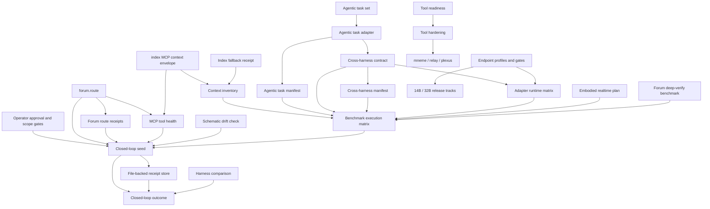

# Closed-Loop Integration Schematic - Codex/Flywheel Local-Model Harness

Date: 2026-07-09

Status: schematic created, not executed.

Machine-readable graph:

- `C:\dev\local-model\project-docs\schematics\closed-loop-integration.graph.json`

## Purpose

The schematic maps the target closed loop as an integration graph rather than a prose roadmap. It separates observed components, scaffolded contracts, degraded dependencies, and missing evidence gates.

## Current graph shape

## Verified versus unverified

Verified or observed in this update:

- The objective file was read from `C:\Users\Zain\.codex\attachments\7a657b2a-776e-435b-bd23-750af5d91e7b\pasted-text-1.txt`.
- `forum.route` is callable and returned a model-foundry validation architecture frame for this work.
- `index.index_context_envelope` is callable but degraded; it returned `Transport closed`.
- `telos_room` is callable and returned `MATCH` with 5 / 5 flagship tools ready for the five-tool room summary.
- Existing roadmap and catalog records live under `C:\dev\local-model\project-docs\records`.
- Existing benchmark contracts live under `C:\dev\local-model\benchmarks`.
- The agentic task manifest generator now exists at `C:\dev\local-model\scripts\run_agentic_task_set_manifest.py`.
- The cross-harness manifest generator now exists at `C:\dev\local-model\scripts\run_cross_harness_manifest.py`.
- The adapter runtime matrix generator now exists at `C:\dev\local-model\scripts\run_adapter_runtime_matrix.py`.
- The embodied realtime plan generator now exists at `C:\dev\local-model\scripts\run_embodied_realtime_multimodal_plan.py`.
- The schematic drift checker now exists at `C:\dev\local-model\scripts\run_schematic_drift_check.py`.
- The Forum route receipt command now exists at `C:\dev\local-model\scripts\run_forum_route_receipts.py`.
- The MCP tool health receipt command now exists at `C:\dev\local-model\scripts\run_mcp_tool_health_receipts.py`.

Not verified in this update:

- No tests were run.
- No benchmarks were run.
- No endpoint probes were run.
- No provider/model calls were run.
- No model weights were read.
- No package/build validation was run.

## Open promotion gates

| Gate | Status | Required evidence |
| --- | --- | --- |
| Index transport | Open | Healthy live Index MCP envelope or fresh degraded fallback receipt with freshness marker. |
| MCP tool health | Open | Executed `harness.mcp-tool-health/v1` receipt with observed healthy/degraded/configured/missing-root tool posture. |
| Forum route receipts | Open | Executed `harness.forum-route-receipts/v1` receipt with route prompt hashes and observed route-frame metadata when available. |
| Metadata preflight | Open | Executed metadata-only command deck artifacts. |
| Agentic manifest | Open | Non-executing manifest generator and targeted validation after approval. |
| Cross-harness adapter | Open | Adapter discovery and comparable scorecard rows for Codex, Flywheel, Claude Code, OpenCode, local 14B, local 32B, and dry roles. |
| Adapter runtime matrix | Open | Executed `harness.adapter-runtime-matrix/v1` artifact showing manifest readiness, auth gates, endpoint-profile gates, and blocking gates for each provider role. |
| Schematic drift | Open | Executed `harness.schematic-drift-check/v1` receipt with no missing required nodes, edges, files, or stale prose. |
| Endpoint health | Open | 14B/32B endpoint profile plus live endpoint gate receipts. |
| Shared benchmark execution | Open | Same task ids and prompt hashes executed through Codex and Flywheel. |
| Forum deep verification scaling | Open | `forum.deep-verify-benchmark/v1` artifacts across large entry/payload/storage/redaction profiles. |
| Enterprise readiness | Open | mneme, relay, and plexus shipped changes with package/docs/tests/CI evidence. |
| Model release | Open | Model cards, checksums, provenance/licensing, endpoint instructions, benchmark evidence, release checklist pass, and publish approval. |
| Experimental outcome | Open | Outcome synthesized from actual benchmark artifacts with raw paths, metrics, limitations, and next actions. |

## Next design implication

The next highest-leverage implementation step is to execute the metadata-only preflight deck when approved, then use the schematic drift receipt to keep graph nodes, command surfaces, and documentation synchronized before provider or endpoint execution.
